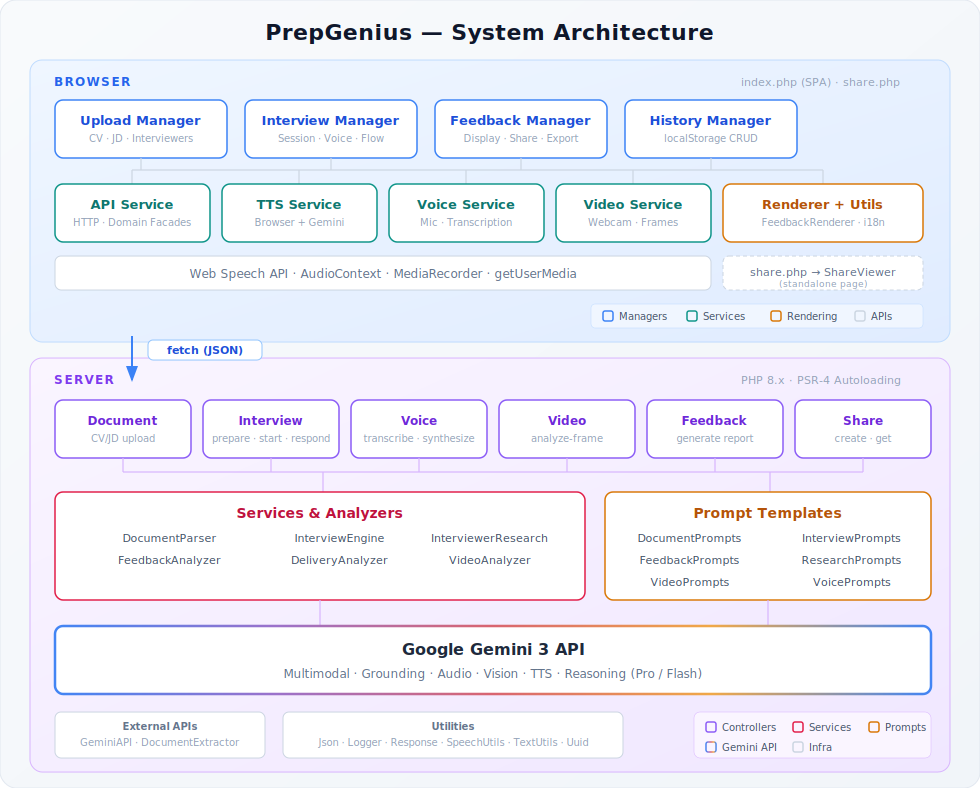

# PrepGenius 🎯

**AI-Powered Interview Preparation Platform**

[](https://deepmind.google/technologies/gemini/)
[](LICENSE)

---

## Overview

**PrepGenius** is the first interview preparation platform that evaluates **what you say, how you say it, and how you look** — in a single AI-driven loop.

Upload your CV, paste a job description, optionally add interviewer names — the AI researches them, generates personalized questions, conducts realistic mock interviews with voice interaction, and delivers comprehensive feedback with video body language analysis.

## Demo

🎥 [Watch the Demo](https://youtu.be/rzI6ydC9b7Q)

🔗 [Try PrepGenius Live](https://wouk1805.com/projects/prepgenius)

---

## Gemini 3 Integration

PrepGenius leverages **six core Gemini 3 capabilities** through a unified pipeline:

| Feature | Gemini Capability | Use Case |
|---------|-------------------|----------|
| **Document Analysis** | Multimodal Document Parsing | Extract skills, experience, achievements from CV and job description |
| **Interviewer Research** | Web Search with Grounding | Find interviewer backgrounds, interests, likely questions |
| **Voice Interview** | Audio Transcription | Real-time speech-to-text for natural conversation |
| **AI Interviewer Voice** | Text-to-Speech | Natural voice synthesis for realistic simulation |
| **Body Language Analysis** | Vision / Image Analysis | Analyze eye contact, posture, confidence from video |
| **Intelligent Feedback** | Advanced Reasoning | Detailed, actionable scoring and improvement suggestions |

The platform relies on a single model family to jointly reason over documents, live audio, video frames, and conversational context. This unified multimodal reasoning enables real-time adaptation that would otherwise require stitching together multiple disconnected systems.

---

## Key Features

### 1. Smart Document Analysis
- **CV Parsing** — Extracts personal info, experience, skills, achievements
- **JD Analysis** — Identifies requirements, responsibilities, key skills
- **Gap Analysis** — Matches CV to JD, surfaces strengths and gaps with mitigation strategies

### 2. Interviewer Research (Grounded Search)
- Web search discovers interviewer backgrounds, expertise, and public statements
- Generates personalized question banks based on each interviewer's likely focus areas
- Adapts interviewer persona with appropriate voice and style

### 3. Realistic Mock Interview
- **Voice Mode** — Speak naturally; Gemini transcribes and responds
- **Text Mode** — Type responses for quieter environments
- **Dynamic Flow** — AI adapts questions based on your answers
- **Multiple Types** — Full, Behavioral, Technical, Quick Practice

### 4. Video Body Language Analysis
- Periodic frame sampling analyzed via Gemini Vision
- Eye contact tracking, posture assessment, confidence scoring
- Aggregated trends over the full interview duration

### 5. Comprehensive Feedback
- Overall score with content, delivery, and visual breakdowns
- Performance summary with key strengths and areas for improvement
- Question-by-question analysis with ideal STAR-format answers
- Speech analytics (pace scoring, filler word detection)
- Actionable next steps and improvement suggestions
- Full interview transcript

### 6. Share & History
- Generate shareable links for interview feedback (no account required)
- Social sharing to LinkedIn and Email
- Automatic local history with progress tracking over time
- Export feedback as PDF

---

## Architecture

### System Overview



<details>
<summary>Text version (for terminals)</summary>

```
┌────────────────────────── Browser ──────────────────────────┐
│                                                             │
│  index.php (SPA)                                            │
│  ┌───────────┐ ┌───────────┐ ┌───────────┐ ┌─────────────┐  │
│  │  Upload   │ │ Interview │ │ Feedback  │ │   History   │  │
│  │  Manager  │ │  Manager  │ │  Manager  │ │   Manager   │  │
│  └─────┬─────┘ └─────┬─────┘ └─────┬─────┘ └──────┬──────┘  │
│        └──────────┬──┴─────────────┘              │         │
│                   ▼                               │         │
│  ┌───────────────────────────────┐ ┌──────────┐   │         │
│  │ api.js │ tts │ voice │ video  │ │ Renderer │◀──┘         │
│  │ Service│ Svc │  Svc  │  Svc   │ │ + Utils  │             │
│  └────┬───┘──┬──┘───┬───┘───┬────┘ └──────────┘             │
│       │   Web Speech   getUserMedia                         │
│       │  AudioContext  MediaRecorder                        │
│       │                                                     │
│  share.php ──▶ share.js + FeedbackRenderer                  │
└───────┼─────────────────────────────────────────────────────┘
        │ fetch (JSON)
        ▼
┌───────────────── PrepGenius API (PHP) ─────────────────┐
│  ┌──────────┐ ┌───────────┐ ┌──────────┐ ┌──────────┐  │
│  │ Document │ │ Interview │ │  Voice   │ │  Video   │  │
│  │Controller│ │ Controller│ │Controller│ │Controller│  │
│  └────┬─────┘ └─────┬─────┘ └────┬─────┘ └────┬─────┘  │
│       │             │            │            │        │
│  ┌────┴─────┐ ┌─────┴───────┐    │            │        │
│  │ Feedback │ │    Share    │    │            │        │
│  │Controller│ │  Controller │    │            │        │
│  └────┬─────┘ └──────┬──────┘    │            │        │
│       └──────────┬───┴───────────┴────────────┘        │
│                  ▼                                     │
│  ┌──────────────────────────────────────────────┐      │
│  │           Services & Analyzers               │      │
│  │ DocumentParser · InterviewEngine             │      │
│  │ InterviewerResearch · FeedbackAnalyzer       │      │
│  │ DeliveryAnalyzer · VideoAnalyzer             │      │
│  └──────────────────────┬───────────────────────┘      │
│                         ▼                              │
│  ┌──────────────────────────────────────────────┐      │
│  │            Google Gemini 3 API               │      │
│  │ Multimodal · Grounding · Audio · Vision      │      │
│  │ TTS · Reasoning (Pro / Flash)                │      │
│  └──────────────────────────────────────────────┘      │
└────────────────────────────────────────────────────────┘
```

</details>

### Frontend Script Load Order

Each file depends on those above it:

| # | File | Exports | Role |
|---|------|---------|------|
| 1 | `core/i18n.js` | `i18n` | Translation dictionaries (EN/FR) |
| 2 | `core/config.js` | `Config` | Constants, API URLs, interview types |
| 3 | `core/utils.js` | `Utils` | DOM helpers, sanitization, and data utilities |
| 4 | `services/api.js` | `api`, `documentService`, `interviewService`, `shareService` | HTTP client and domain facades |
| 5 | `services/tts-service.js` | `geminiTts`, `browserTts`, `ttsService` | Dual-engine text-to-speech |
| 6 | `services/voice-service.js` | `voiceService` | Microphone recording and transcription |
| 7 | `services/video-service.js` | `videoService` | Webcam capture and frame analysis |
| 8 | `features/feedback-utils.js` | `FeedbackUtils` | Bilingual feedback resolver |
| 9 | `features/feedback-renderer.js` | `FeedbackRenderer` | Shared score/report UI |
| 10 | `features/history-manager.js` | `historyManager` | localStorage CRUD |
| 11 | `features/upload-manager.js` | `UploadManager` | CV/JD upload flows |
| 12 | `features/interview-manager.js` | `InterviewManager` | Interview session logic |
| 13 | `features/feedback-manager.js` | `FeedbackManager` | Feedback orchestration |
| 14 | `features/pdf-export.js` | `pdfExport` | Browser print-to-PDF |
| 15 | `app.js` | `App` → `window.app` | Entry point, wires everything |

Loaded separately by `share.php`:

| # | File | Exports | Role |
|---|------|---------|------|
| — | `share.js` | `ShareViewer` | Shared feedback page controller |

### Backend Namespace Map

All PHP classes live under the `PrepGenius` namespace (PSR-4 autoloaded):

| Namespace | Directory | Purpose |
|-----------|-----------|---------|
| `PrepGenius\Controllers` | `src/Controllers/` | HTTP request handlers |
| `PrepGenius\Services` | `src/Services/` | Business logic and analysis |
| `PrepGenius\Prompts` | `src/Prompts/` | AI prompt templates |
| `PrepGenius\ExternalAPIs` | `src/ExternalAPIs/` | Third-party API wrappers |
| `PrepGenius\Utils` | `src/Utils/` | Shared utilities |

---

## API Endpoints

| Method | Endpoint | Description |
|--------|----------|-------------|
| `POST` | `/api/documents/upload` | Parse CV or job description |
| `POST` | `/api/interviews/prepare` | Research interviewers, analyze match |
| `POST` | `/api/interviews/start` | Begin interview session |
| `POST` | `/api/interviews/respond` | Process candidate response |
| `POST` | `/api/voice/transcribe` | Audio → text (Gemini) |
| `POST` | `/api/voice/synthesize` | Text → speech (Gemini TTS) |
| `POST` | `/api/voice/ping` | Check Gemini TTS API quota |
| `POST` | `/api/video/analyze-frame` | Analyze video frame (Gemini Vision) |
| `POST` | `/api/feedback/generate` | Generate comprehensive feedback |
| `POST` | `/api/share` | Create shareable feedback link |
| `GET`  | `/api/share/{id}` | Retrieve shared feedback |

---

## Quick Start

### Prerequisites
- PHP 8.x
- Google Gemini API Key ([get one here](https://aistudio.google.com/))

### Installation

```bash
# 1. Clone the project
git clone https://github.com/wouk1805/prepgenius.git
cd prepgenius

# 2. Configure API key
cp src/secrets.example.php src/secrets.php
# Edit src/secrets.php and add your Gemini API key

# 3. Create storage directories
mkdir -p storage/{uploads,sessions,logs,shares}
chmod 755 storage/*

# 4. Deploy to a PHP web server
# Upload to /projects/prepgenius/ on your server
```

---

## Project Structure

```
prepgenius/
├── index.php                           # Frontend SPA entry point
├── share.php                           # Shared feedback page
├── .htaccess                           # URL routing & security
├── architecture.svg                    # System architecture diagram
│
├── api/
│   └── router.php                      # API request dispatcher
│
├── src/
│   ├── autoload.php                    # PSR-4 class autoloader
│   ├── config.php                      # App configuration & constants
│   ├── secrets.php                     # API keys (gitignored)
│   │
│   ├── Controllers/                    # HTTP request handlers
│   │   ├── DocumentController.php      #   CV/JD upload & parsing
│   │   ├── InterviewController.php     #   Prepare, start, respond
│   │   ├── VoiceController.php         #   Audio transcription & TTS
│   │   ├── VideoController.php         #   Video frame analysis
│   │   ├── FeedbackController.php      #   Performance report generation
│   │   └── ShareController.php         #   Shareable link management
│   │
│   ├── Services/                       # Business logic layer
│   │   ├── DocumentParser.php          #   CV/JD parsing & match analysis
│   │   ├── InterviewEngine.php         #   Conversation flow & question logic
│   │   ├── InterviewerResearch.php     #   Web research & persona generation
│   │   ├── FeedbackAnalyzer.php        #   Scoring, analysis & report building
│   │   ├── DeliveryAnalyzer.php        #   Speech pace scoring & filler detection
│   │   └── VideoAnalyzer.php           #   Frame aggregation & visual scoring
│   │
│   ├── Prompts/                        # AI prompt templates
│   │   ├── DocumentPrompts.php         #   CV/JD parsing & match prompts
│   │   ├── FeedbackPrompts.php         #   Feedback analysis prompts
│   │   ├── InterviewPrompts.php        #   Interview conversation prompts
│   │   ├── ResearchPrompts.php         #   Interviewer research prompts
│   │   ├── VideoPrompts.php            #   Video frame analysis prompts
│   │   └── VoicePrompts.php            #   Audio transcription prompts
│   │
│   ├── ExternalAPIs/                   # Third-party integrations
│   │   ├── GeminiAPI.php               #   Google Gemini API wrapper
│   │   └── DocumentExtractor.php       #   DOCX/DOC text extraction
│   │
│   └── Utils/                          # Shared utilities
│       ├── Json.php                    #   JSON parsing & encoding helpers
│       ├── Logger.php                  #   File-based logging with sanitization
│       ├── Response.php                #   Standardized JSON responses
│       ├── SpeechUtils.php             #   Filler word detection & voice mapping
│       ├── TextUtils.php               #   Name formatting (hyphenated, prefixed)
│       └── Uuid.php                    #   UUID v4 generation
│
├── css/
│   ├── core/                           # Foundation styles
│   │   ├── base.css                    #   Variables, reset, typography, animations
│   │   ├── components.css              #   Buttons, cards, forms, modals, toasts
│   │   └── layout.css                  #   Header, nav, sections, footer
│   │
│   ├── pages/                          # Page-specific styles
│   │   ├── home.css                    #   Hero section & features grid
│   │   ├── prepare.css                 #   Steps, upload, interviewers, ready card
│   │   ├── interview.css               #   Interview session UI & response area
│   │   └── feedback.css                #   Score card, feedback cards, analytics
│   │
│   ├── features/                       # Feature-specific styles
│   │   ├── history.css                 #   Interview history section
│   │   └── share.css                   #   Share modal & share page
│   │
│   └── overrides/                      # Cross-cutting overrides
│       ├── responsive.css              #   Mobile & tablet breakpoints
│       └── print.css                   #   Print-friendly feedback layout
│
├── js/
│   ├── core/                           # Foundation (loaded first)
│   │   ├── i18n.js                     #   EN/FR translation dictionaries
│   │   ├── config.js                   #   App constants & shared configuration
│   │   └── utils.js                    #   DOM helpers & data utilities
│   │
│   ├── services/                       # API & device abstraction layer
│   │   ├── api.js                      #   HTTP client & domain service facades
│   │   ├── tts-service.js              #   Dual-engine TTS (Browser + Gemini)
│   │   ├── voice-service.js            #   Microphone recording & transcription
│   │   └── video-service.js            #   Webcam capture & frame analysis
│   │
│   ├── features/                       # UI managers & rendering
│   │   ├── upload-manager.js           #   CV/JD file & text input handling
│   │   ├── interview-manager.js        #   Interview session orchestration
│   │   ├── feedback-manager.js         #   Feedback display & sharing
│   │   ├── feedback-renderer.js        #   Score cards & report rendering
│   │   ├── feedback-utils.js           #   Bilingual feedback resolution
│   │   ├── history-manager.js          #   localStorage interview history
│   │   └── pdf-export.js               #   Browser-native PDF export
│   │
│   ├── app.js                          # Main SPA entry point
│   └── share.js                        # Shared feedback page controller
│
└── storage/
    ├── uploads/                        # Temporary file uploads
    ├── sessions/                       # PHP sessions
    ├── shares/                         # Shared feedback JSON files
    └── logs/                           # Application logs
```

---

## Tech Stack

| Layer | Technology |
|-------|------------|
| **Frontend** | Vanilla JavaScript, CSS3 (no frameworks, no build step) |
| **Backend** | PHP 8.x (PSR-4 autoloading) |
| **AI** | Google Gemini 3 (Flash, Pro, TTS) |
| **Languages** | English, French (full i18n) |
| **Design** | Glassmorphism, CSS custom properties, responsive |

---

## Security

- `.htaccess` blocks access to `/src/`, `/storage/`, and sensitive files
- API keys stored in `secrets.php` (gitignored)
- Input validation and sanitization on all endpoints
- CORS configuration for allowed origins
- Sensitive data redacted from logs

---

## Internationalization

Full bilingual support:
- 🇬🇧 English
- 🇫🇷 French

All UI elements, error messages, and AI-generated content adapt to the selected language.

---

## Future Roadmap

### User Accounts & Cloud Sync
- OAuth login (Google, LinkedIn, GitHub)
- Cloud-synced interview history across devices
- Personal dashboard with progress tracking

### Enhanced Analytics
- Performance trends across multiple interviews
- Anonymized peer benchmarks
- Skill gap analysis and personalized practice recommendations

### Team & Enterprise
- Team workspaces for hiring managers
- Custom question banks per company/role
- Interview scorecards for recruitment workflows

### Advanced AI
- Real-time follow-up interruption
- Industry-specific feedback models
- Multi-language expansion beyond EN/FR

---

## Contributing

Contributions are welcome! Please fork, create a feature branch, and submit a pull request. All contributions must be licensed under GPLv3.

---

## License

This project is licensed under the GNU General Public License v3.0 — see [LICENSE](LICENSE) for details.

---

## Author

**Young-wouk KIM**
- 🌐 [wouk1805.com](https://wouk1805.com)
- 💼 [LinkedIn](https://www.linkedin.com/in/young-wouk-kim/)
